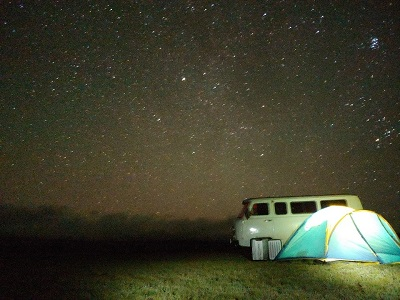

<h3 align="right"><a href="https://github.com/HyeEmpathyDev/Study-log">📦StudyLog</a></h3>

###
<h1 align="left">About me</h1>

###

💼 경력 
금융권에서 10년 동안 수신, 여신 포함 다양한 신용업무를 맡았어요! 지금은 열심히 공부 중입니다. 

📚 배우는 중 
KB IT’s Your Life 교육과정에서 프론트엔드 & 백엔드 개발을 배우고 있어요! 

📸 MBTI 
ENFP지만… E 중에서도 I에 가까운 편! 🏕️  

🌟 성격 
파워 긍정!💪 힘든 일이 있어도 '어쩌겠어~ 그럴 수도 있지~’ 마인드 

🚴‍♂️ 취미 
테니스🎾 풋살⚽ 영화🎬 다 좋아해요! 날씨 좋을 땐 자전거🚴‍♂️도 탑니다~ 

🌍 여행 
스위스에서 본 설경, 몽골에서 본 별🌠이 인생 여행지!

🐻 좋아하는 것 
귀여운 거... 너무 좋아요... ❤️ (진심)

###

<h1 align="left">TMI</h1>

😆 코딩을 해보고 싶어서 승진하자마자 명예퇴직! 그렇게... 최연소 명퇴자 타이틀을… 😂 

🍻🍖 맛있는 음식이랑 술 마시는 걸 좋아하는데… 얼마 전에 교정을 시작해서 먹기가 힘들어요😭 (곧 괜찮아지면 같이 먹으러 가요!) 

💬 "자존감 지킴이"라는 별명이 있음. 칭찬 잘함!(너무 자주해서 영혼 없다는 말도 자주 들음..) 😆 

###

<h2 align="left">KB IT’s Your Life - 배우는 중!</h2>

###

📖 Step 1: 프론트엔드 개발(현재 공부중!💻🔥) 

✔ HTML, CSS, JavaScript 기본기 다지기 
✔ Node.js & Vue.js로 프로젝트 해보기 
✔ UI/UX 특강 & 협업 실습 

💡 Step 2: 백엔드 기초 

✔ Java 프로그래밍 심화 
✔ MySQL & 데이터 모델링 이해 

🚀 Step 3: 백엔드 심화 

✔ Spring Framework로 서버 개발 
✔ Rest API 설계 & 구축 실습 

🌟 Step 4: 최종 프로젝트 

✔ 금융 IT 실무 프로젝트 
✔ 현직자 멘토링까지! 

###

<h2 align="left">Skills & Tools</h2>

🖍️ Frontend Development: HTML | CSS | JavaScript | Node.js | Vue.js 🛠️ Backend Development: Java | Spring Framework | Rest API | Servlet | JSP 🗄️ Database & Tools: MySQL | MongoDB | Git | GitHub

###

<h2> GitHub Stats </h2>

###

####
---
_"낙엽을 보며 배우는 것 한 가지  
일생 동안 나는 어떻게 물들어가야 하는 것  
떠날 때 보면 안다 - 안도현, <잡문>"_  

